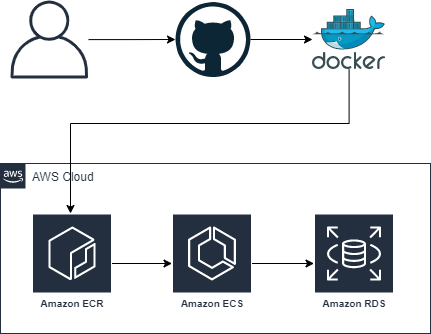

# nkitmitto-ginger-example
Ginger App Example

# Include Architecture Diagram

# Architecture Diagram Explanation
The architecture diagram above flows as such:
1) The developer pushes to GitHub.  Typically, a pull request and code review would occur.  Upon successful code review and approval for the PR, GitHub Actions would be triggered.
2) GitHub Actions builds the docker image per the Dockerfile specifications.  In the Dockerfile, it runs the [config.sh](config.sh) script to properly configure the docker image. Detailing out the Dockerfile and pushing method:
2a) The first line installs required tools to download and compile mod_wsgi (for Flask).  It installs Apache, Apache Development Tools, Python3, Python3-pip (tool for easily installing Python3 libraries), Python3 Development Tools, GCC and GCC-C++ (compilers for building packages from source), MySQL Development Tools (allows the Flask app to communicate to the RDS instance), Git, Wget, Unzip, Make (required to compiler from source), and mod_security.
2b) With Python3's pip, we install Flask (web engine for Python), Flask-MySQLDB (Allows Flask to communciate with MySQL), AWSCli, and Boto3 (The AWS SDK for Python)
2c) Download and unzip mod_wsgi so we can run the Flask app through Apache using sockets
2d) Compile the mod_wsgi package from source and install it on the system.  Once instlal is done, load the module into Apache
2e) Grab the owasp-modsecurity rules from GitHub and place them on the system so we can use them in the application.
2f) Because we're enabling mod_security for one virtualhost and not the other, I wanted mod_security.conf to sit in /etc/httpd/modsecurity.d.  This allowed me to still load all config files needed from /etc/httpd/conf.d/* without detailing out each one specifically.  Then, only for the not-vulnerable application, I was able to explicitly load the modsecurity module.
2g) Once the Docker image was built, GitHub actions pushes to ECR.  The credentials to push to ECR are in the GitHub secrets.  These secrets cannot be viewed again once placed, but they can overwritten. 
3) Within the AWS Cloud box, we have ECS and RDS.  The ECS task uses Secrets Manager to get the credentials to log into the RDS instance.  This allows the ECS task to interact with the database with credentials, but not publishing the credentials in plain text such as a version control system.  RDS stores the inputs on the website.

# Include Todo Items
* Create CDK to create the VPC.  Leveraging CDK to create the infrastructure allows the environment to stay a read-only environment for users but write access for things such as pipelines.  It ensures we can easily repeat the exact same setup if we were to deploy the app in another environment, or use the same infrastructure for multiple apps.  This CDK would typically have resources such as: VPC, 4 Subnets (2 public, 2 private), Route Tables, Site-to-site VPN configuration, NACLs (if applicable), AWS Config rules, SNS topics for Config rule violation notifications, CloudTrail, NAT Gateways, and an Internet Gateway.
* The requirements specified this implementation was not to cost any money.  However, if this requirement weren't here, I would build in an ALB in front of the ECS tasks so if the task were to be recreated, no changes would need to occur with the public IP changing.
* AWS Config rules - I would want to know if someone changed my security group for the ECS task and be emailed immediately.
* Static asset hosting - Images would be hosted on S3 if this were a production application.  Ensuring the environment was low cost, and the servers could be terminated and recreated (or scale automatically) without affecting the application.

